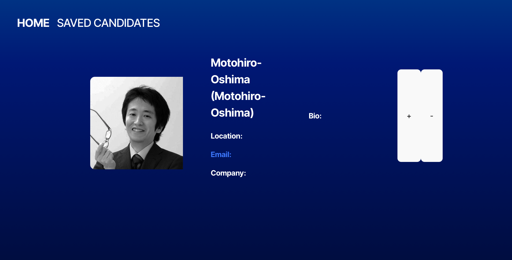
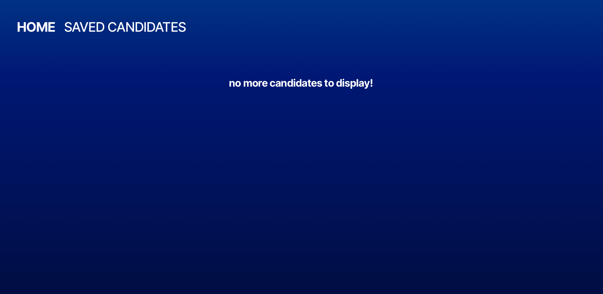
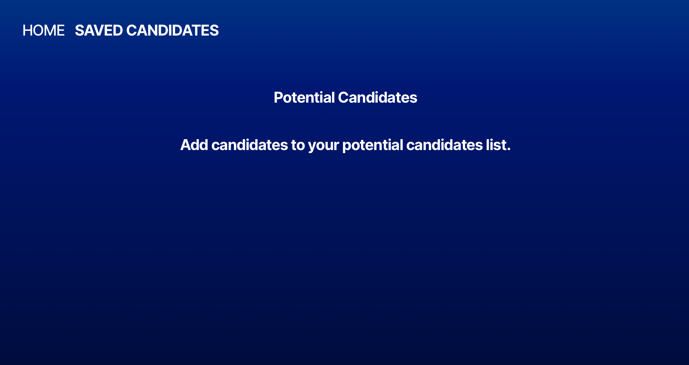
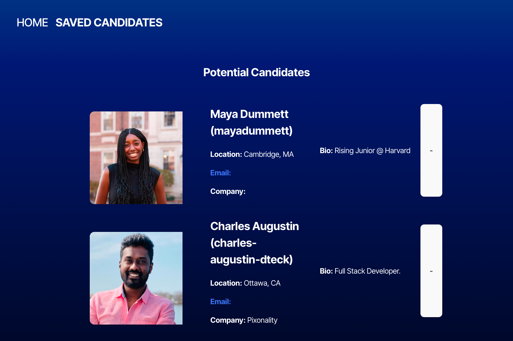

# candidate-search

## Description

This app aims to create a candidate search simulation by importing a list of potential "candidates" from Github via their API, and display info for each candidate one at a time, allowing you to either reject the candidate immediately or save them to a potential candidates list before moving on to the next candidate.

Through this project, I primarily learned more about using React with Typescript, and got to practice my skills with React Router, Vite, local storage, and external API's that use tokens.

## Table of Contents

- [Installation](#installation)
- [Usage](#usage)
- [Credits](#credits)
- [License](#license)

## Installation

Copy the SSH Key from the [GitHub Repository](https://github.com/dcartolano/candidate-searchy) and perform a git clone into a local directory of your choice. Open in VS Code or similar program. In the integrated terminal, run `npm i` to download all relevant node modules. 

You'll need to request a fine-grained Github personal access token, which you can learn about how to create 
[here](https://docs.github.com/en/authentication/keeping-your-account-and-data-secure/managing-your-personal-access-tokens#creating-a-fine-grained-personal-access-token). To find out more about authenticating to the GitHub Rest API, 
[click here](https://docs.github.com/en/rest/authentication/authenticating-to-the-rest-api?apiVersion=2022-11-28#authenticating-with-a-personal-access-token).

After you have your token, you'll need to place it in the .env.EXAMPLE file, and then remove the example and rename to just `.env`.

## Usage

If you only want to navigate to the deployed site, you can view it [here](https://candidate-searchy.netlify.app).

If you are trying to view the app locally through the terminal, right click on the package.json file in the outermost folder and select "Open in Integrated Terminal", then run the commands `npm run build` and `npm run start` to launch the application, which should open in your browser automatically. If it does not, click/copy the link in the terminal where it tells you the server is running and open in your preferred browser.

Homepage will automatically pull in candidates and their info when it loads. You can use the "+" button to add the current candidite to your saved candidates list and show the next candidate, or use the "-" button to reject the candidate and show the next candidate. 

Once you have gone through all the candidates, the page will display a message telling you there are no more candidates left to display.

If you have not added anyone to the list, the saved candidates page will display a message instructing you to add potential candidates to the list.

Once you've saved candidates, the page will display their profile cards in the order that you've added them. To reject a candidate and remove them from your list, click the "-" button. 

## Credits

Thanks to EdX and Northwestern for the starter code and the opportunity to practice these skills. 

Thanks also to my instructor and the EdX tutors for all the help and clarifications along the way.

I referenced [this video](https://www.youtube.com/watch?v=-4XpG5_Lj_o&t=631s) to help me get started with using useEffect.

## License

n/a

